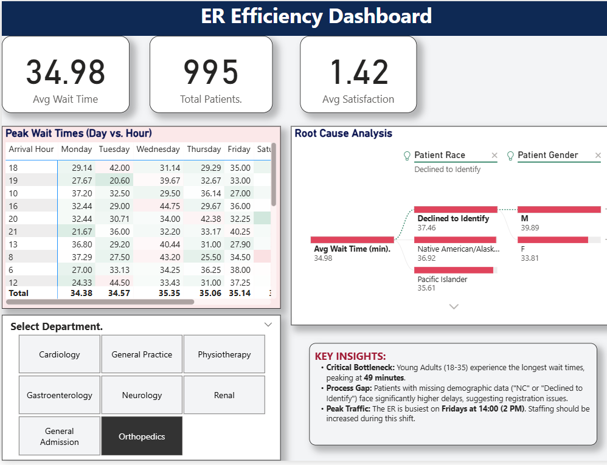

# 🏥 Emergency Room Efficiency Dashboard

## 🛠️ Tools & Technologies

* **Power BI:** Main dashboard visualization, DAX measures, and interactive reporting.
* **Microsoft Excel:** Used as the primary data source and for initial data verification.
* **Power Query:** Data cleaning and ETL processing.
* **Data Modeling:** Star Schema design.

##  Project Overview
This project analyzes patient wait times and service efficiency in a hospital Emergency Room (ER). The goal was to identify bottlenecks, optimize staffing schedules, and improve patient satisfaction using data-driven insights.

**View the full PDF Report:** [Click here to read the Analysis (PDF)](ER_Project_Report.pdf)

##  Key Business Insights
* **Peak Traffic Identified:** Heatmap analysis revealed that **Fridays at 2:00 PM** are the busiest times, requiring increased staffing.
* **Root Cause of Delays:** The Decomposition Tree showed that **Young Adults (18-35)** have the highest average wait time (49 minutes).
* **Process Gap:** Patients with missing demographic data ("NC") experienced significantly longer processing times.

##  Files in this Repository
* **ER_Efficiency_Dashboard_Final.pbix**: The raw Power BI source file.
* **ER_Project_Report.pdf**: The polished business report.
* **ER_Efficiency_Dashboard_Final.pdf**: Visual export of the dashboard.

---
*Analyst: Mahima Gupta*
